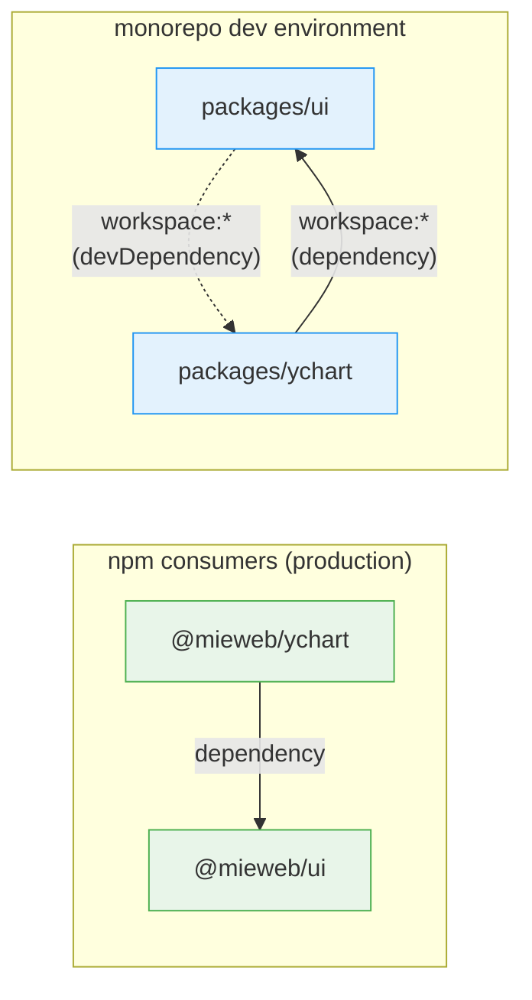

# PRD: Monorepo Migration for @mieweb/ui + @mieweb/ychart

## Problem Statement

`@mieweb/ychart` depends on `@mieweb/ui` for React UI components (Select, Button, Badge, Alert, Input, Tooltip, Checkbox). We want to showcase ychart as a **Feature Module** inside ui's Storybook. This creates a circular dependency: `ui → ychart → ui`.

## Goal

Merge both repositories into a single **pnpm workspace monorepo** so ychart can appear as a Feature Module in ui's Storybook without circular dependencies. Both packages continue to publish independently to npm.

## Current State

| Property | @mieweb/ui | @mieweb/ychart |
|---|---|---|
| **Version** | 0.2.4 | 1.1.0 |
| **Build tool** | tsup (ESM + CJS) | Vite (IIFE) |
| **Target** | ES2022 | ES2015 |
| **Node version** | 20 (CI) | >=24.0.0 (strict) |
| **Framework** | React component library | Vanilla TS + D3 (React via bridge) |
| **Storybook** | Yes (React-Vite, v10) | No |
| **CI runners** | GitHub-hosted | Self-hosted |
| **npm publishing** | OIDC/provenance | OIDC/provenance |

### Dependency Chain

```
@mieweb/ychart
  └── @mieweb/ui (production dep)
        └── react, react-dom (peer deps)
```

### ychart's Usage of ui

Located in `src/modules/reactBridge.tsx` — imports 7 components via a React bridge layer that mounts them into vanilla DOM containers:

- `Select`, `Input`, `Checkbox` (form)
- `Button` (actions)
- `Alert`, `AlertTitle`, `AlertDescription` (feedback)
- `Badge`, `Tooltip` (UX)

## Proposed Solution: pnpm Workspace Monorepo

### Target Structure

```
mieweb-platform/          ← new monorepo root (or reuse existing repo)
├── package.json           ← private, no publish, shared scripts
├── pnpm-workspace.yaml    ← defines packages/*
├── turbo.json             ← build orchestration
├── .npmrc
├── packages/
│   ├── ui/                ← current @mieweb/ui (unchanged internals)
│   │   ├── package.json
│   │   ├── tsup.config.ts
│   │   ├── .storybook/
│   │   └── src/
│   │       └── components/
│   │           └── YChart/
│   │               └── YChart.stories.tsx   ← NEW: Feature Module story
│   └── ychart/            ← current @mieweb/ychart (unchanged internals)
│       ├── package.json
│       ├── vite.config.ts  ← MODIFIED: add ESM output
│       └── src/
```

---

## Implementation Phases

### Phase 1: Repository Structure

**Objective**: Create the monorepo shell and move both packages into it.

| Step | Action | Details |
|------|--------|---------|
| 1.1 | Create monorepo root | `pnpm-workspace.yaml` with `packages: ['packages/*']` |
| 1.2 | Root `package.json` | `"private": true`, shared scripts (`build`, `lint`, `test`), `"packageManager": "pnpm@10.29.1"` |
| 1.3 | Add Turborepo | `turbo.json` with build dependency graph: ychart `dependsOn` ui build |
| 1.4 | Move repos | `ui/` → `packages/ui/`, `orgchart/` → `packages/ychart/` |
| 1.5 | Root `.npmrc` | `@mieweb:registry=https://registry.npmjs.org/` |
| 1.6 | Unify Node version | **24** (ychart's strict requirement is the constraint) |

**Git history strategy**: Use `git subtree add` to preserve both repos' histories in the new monorepo, or start fresh. Decision needed before execution.

### Phase 2: Add ESM Build to YChart

**Objective**: ychart currently builds as IIFE only. Storybook's Vite pipeline requires ESM imports.

| Step | Action | Details |
|------|--------|---------|
| 2.1 | Modify `vite.config.ts` | Add ESM output alongside IIFE: `formats: ['es', 'iife']` |
| 2.2 | Externalize shared deps | Mark `@mieweb/ui`, `react`, `react-dom` as externals in ESM build |
| 2.3 | Update `package.json` exports | Add ESM entry point: `"import": "./dist/ychart-editor.es.js"` |

**Note**: IIFE build remains for standalone/embedded usage. ESM build is for module consumers and Storybook.

### Phase 3: Wire Up Workspace Dependencies

**Objective**: Replace npm registry references with workspace protocol.

| Step | Action | Details |
|------|--------|---------|
| 3.1 | ychart `package.json` | Change `"@mieweb/ui": "^0.2.4"` → `"@mieweb/ui": "workspace:*"` |
| 3.2 | `pnpm install` from root | Workspace protocol resolves to local package |
| 3.3 | Verify ychart build | `pnpm --filter @mieweb/ychart build` succeeds |

**pnpm publish behavior**: `workspace:*` is automatically replaced with the actual version number during `pnpm publish`, so consumers get a normal semver dependency.

### Phase 4: Create YChart Feature Module Story in UI

**Objective**: Show ychart in ui's Storybook under `Product/Feature Modules/YChart`.

| Step | Action | Details |
|------|--------|---------|
| 4.1 | Add ychart as **devDependency** in ui | `"@mieweb/ychart": "workspace:*"` in `devDependencies` |
| 4.2 | Create story directory | `packages/ui/src/components/YChart/` |
| 4.3 | Create `YChart.stories.tsx` | React wrapper that mounts `YChartEditor` into a ref'd div |
| 4.4 | Include sample YAML | Embed sample org chart data in the story |

**Why devDependency**: ychart is only needed for Storybook stories, not for ui's published output. This means:
- **npm consumers of @mieweb/ui** do NOT get ychart installed → **no circular dependency**
- **Storybook dev environment** CAN import ychart → Feature Module works

### Phase 5: Unify CI/CD

**Objective**: Single CI pipeline with path-filtered triggers.

| Workflow | Trigger | Scope |
|----------|---------|-------|
| `ci.yml` | Push/PR | Matrix: lint, test, typecheck per package. Path filters: `packages/ui/**`, `packages/ychart/**` |
| `release-ui.yml` | Tag `ui-v*` | Build + publish @mieweb/ui with provenance |
| `release-ychart.yml` | Tag `ychart-v*` | Build + publish @mieweb/ychart with provenance |
| `deploy-ychart.yml` | Push to main + `packages/ychart/**` | Self-hosted runner, deploy app |
| `deploy-docs.yml` | Push to main + `packages/ychart/docs/**` | Self-hosted runner, deploy Docusaurus |

**Turborepo in CI**: `turbo run build --filter=@mieweb/ui` for targeted builds with dependency-aware caching.

---

## Dependency Graph (After Migration)



**Key**: The dashed line (devDependency) is stripped during publish. No circular dependency reaches npm consumers.

---

## Verification Criteria

| # | Check | Command |
|---|-------|---------|
| 1 | No circular dep warnings | `pnpm install` at root |
| 2 | ychart builds both IIFE + ESM | `pnpm --filter @mieweb/ychart build` |
| 3 | YChart visible in Storybook Feature Modules | `pnpm --filter @mieweb/ui storybook` |
| 4 | YChart story renders interactive chart | Manual verification |
| 5 | ui build excludes ychart from dist | `pnpm --filter @mieweb/ui build` |
| 6 | No `workspace:` leaks in published package | `pnpm --filter @mieweb/ui publish --dry-run` |
| 7 | All existing tests pass | `turbo run test` |

---

## Decisions

| Decision | Choice | Rationale |
|----------|--------|-----------|
| Monorepo tool | **Turborepo** | Lightweight, pnpm-native, simple config vs Nx |
| Node version | **24** | ychart's `engines.node >= 24` is the stricter constraint |
| ychart in ui | **devDependency only** | No circular dep for npm consumers |
| ESM build for ychart | **Required** | Storybook Vite pipeline cannot import IIFE bundles |
| Package manager | **pnpm** (already used by both) | No migration needed |

## Open Questions

1. **Git strategy**: Create fresh repo with `git subtree add` (preserves history) or start fresh?
2. **Shared configs**: Should ESLint, Prettier, and TypeScript configs be shared at root with per-package overrides?
3. **Story scope**: Start with a simple static chart render, or full interactive editor with YAML sidebar?
4. **Monorepo repo name**: `mieweb/platform`, `mieweb/mieweb`, or something else?

---

## Out of Scope

- Refactoring ychart internals (React bridge, D3 code)
- Changing ui's component API
- Migrating ychart's Docusaurus docs site
- Changing ychart's production deployment target (`/var/www/html/`)
- Adding new ui components
