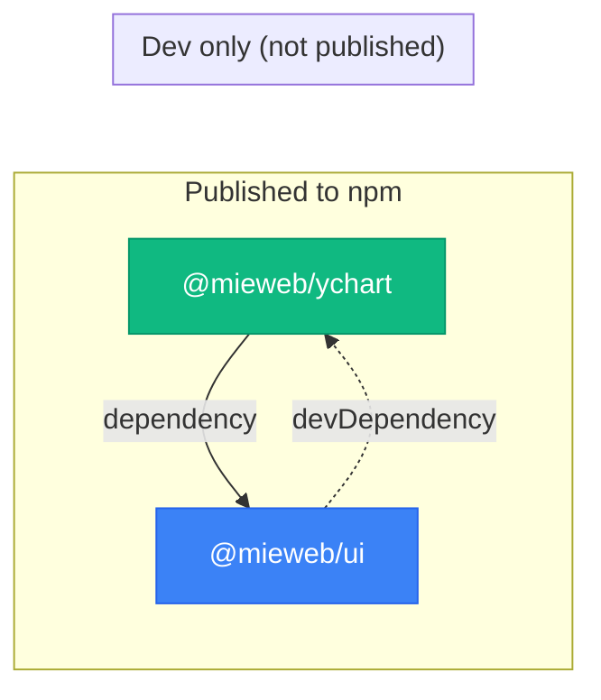

<div align="center">

# 🏗️ miewebui-root

**The unified workspace for the @mieweb/ui ecosystem**

[](https://pnpm.io/workspaces)
[](https://turbo.build/)
[](https://storybook.js.org/)
[](https://nodejs.org/)
[](https://opensource.org/licenses/MIT)

A pnpm monorepo that coordinates the MIE React component library and feature module packages.<br/>
Add your own package under `packages/` and get Storybook, shared tooling, and workspace linking for free.

---

**[@mieweb/ui](https://github.com/mieweb/ui)** · **[@mieweb/ychart](https://github.com/mieweb/ychart)** · **[Storybook →](https://mieweb.github.io/ui)**

</div>

---

## 📦 Packages

| Package | Description | Version |
|---------|-------------|---------|
| [`@mieweb/ui`](https://github.com/mieweb/ui) | Themeable, accessible React component library | [](https://www.npmjs.com/package/@mieweb/ui) |
| [`@mieweb/ychart`](https://github.com/mieweb/ychart) | Interactive org chart editor with YAML & D3.js | [](https://www.npmjs.com/package/@mieweb/ychart) |

Each folder under `packages/` is a **git submodule** — clicking them on GitHub navigates directly to the original repo.

```
miewebui-root/
├── 📄 package.json              private root (not published)
├── 📄 pnpm-workspace.yaml       workspace: packages/*
├── 📄 turbo.json                build orchestration
└── 📂 packages/
    ├── 📦 ui/                   → github.com/mieweb/ui
    └── 📦 ychart/               → github.com/mieweb/ychart
```

## 🚀 Getting Started

```bash
# Clone with submodules
git clone --recurse-submodules https://github.com/mieweb/miewebui-root.git
cd miewebui-root

# Install all dependencies
pnpm install

# Build everything (ui first, then ychart — Turborepo handles ordering)
turbo run build

# Launch Storybook with all Feature Modules
pnpm storybook
```

> **Already cloned without submodules?**
> ```bash
> git submodule update --init --recursive
> ```

## 🔧 Developer Workflow

### Working on a package

Changes happen **inside** the submodule — committed and pushed to the package's own repo:

```bash
cd packages/ui
git checkout -b my-feature
# make changes...
git add . && git commit -m "feat: my change"
git push -u origin my-feature
```

Then update the root to track the new commit:

```bash
cd ../..
git add packages/ui
git commit -m "chore: update ui submodule"
git push
```

### Pulling latest

```bash
# All submodules
git submodule update --remote --merge

# Specific package
cd packages/ui && git pull origin main
```

### ➕ Adding a new package

1. Create a repo (e.g., `mieweb/my-package`)
2. Add it as a submodule:
   ```bash
   git submodule add https://github.com/mieweb/my-package.git packages/my-package
   ```
3. The `packages/*` glob picks it up automatically — no config changes needed
4. Reference sibling packages with `"workspace:*"` in your `package.json`
5. Add Feature Module stories in `packages/ui/src/components/` to showcase in Storybook

## 🔗 Dependency Graph



> The dashed line (devDependency) is **stripped during `pnpm publish`** — no circular dependency reaches npm consumers.

## 📋 Scripts

| Command | Description |
|---------|-------------|
| `pnpm install` | Install all workspace dependencies |
| `turbo run build` | Build all packages (dependency-aware) |
| `pnpm storybook` | Launch Storybook with Feature Modules |
| `pnpm --filter @mieweb/ui build` | Build only ui |
| `pnpm --filter @mieweb/ychart build` | Build only ychart |

## ⚙️ Requirements

| Tool | Version |
|------|---------|
| Node.js | `>= 24.0.0` |
| pnpm | `>= 10.29.1` |

---

<div align="center">

Made with ❤️ by [Medical Informatics Engineering](https://mieweb.com)

</div>
